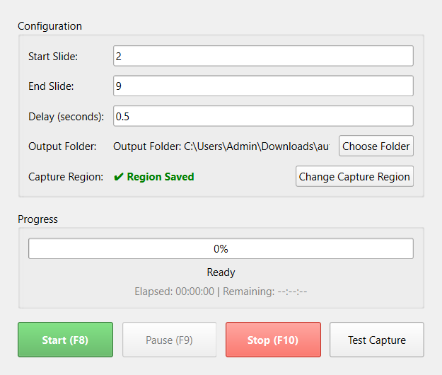
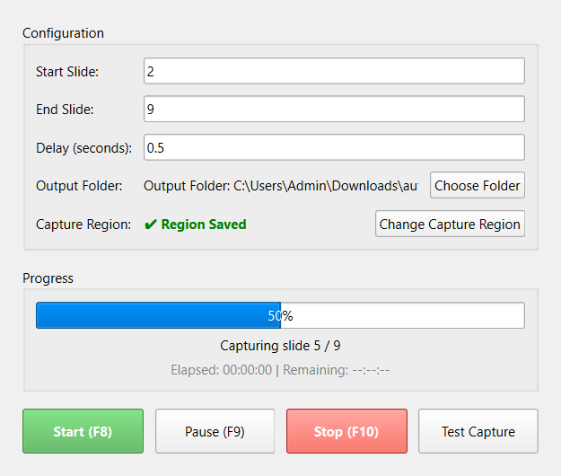

# Hướng Dẫn Sử Dụng: Auto Slide Capture

Auto Slide Capture là ứng dụng giúp bạn tự động chụp liên tiếp các trang slide (PowerPoint, Google Slides, PDF) đang hiển thị trên màn hình và lưu thành các ảnh riêng biệt.

## 1. Chuẩn Bị
1. Mở phần mềm **Auto Slide Capture**.
2. Mở trình duyệt web hoặc phần mềm đang hiển thị Slide của bạn.
3. **Đảm bảo không thao tác chuột hay bàn phím** trong lúc phần mềm đang chạy tự động để tránh làm sai lệch quá trình chụp.

## 2. Các Bước Thao Tác

### Bước 1: Thiết lập thông số
Trên giao diện chính của ứng dụng, bạn cần thiết lập:
- **Start Slide:** Nhập số của trang slide bạn muốn bắt đầu chụp (ví dụ: `2`).
- **End Slide:** Nhập số của trang slide cuối cùng bạn muốn chụp (ví dụ: `9`).
- **Delay (seconds):** Thời gian chờ giữa 2 lần chụp (Mặc định: `0.5` giây). Nếu máy tính hoặc mạng hơi chậm, bạn nên tăng lên `1.0` để trang web kịp tải hình ảnh đầy đủ.

*(Thêm ảnh chụp màn hình giao diện ứng dụng tại đây)*

### Bước 2: Chọn thư mục lưu ảnh
- Bấm vào nút **"Choose Folder"**.
- Chọn một thư mục trên máy tính mà bạn muốn lưu các ảnh slide sau khi chụp.
- Đường dẫn thư mục sẽ hiển thị ở dòng `Output Folder`.

### Bước 3: Khoanh vùng cần chụp
- Bấm vào nút **"Change Capture Region"**.
- Màn hình sẽ mờ đi và xuất hiện con trỏ chuột hình chữ thập.
- **Kéo và thả chuột** để vẽ một khung chữ nhật màu đỏ bao quanh đúng phần hiển thị của trang Slide.
- Sau khi thả chuột ra, bấm phím **Enter** trên bàn phím để lưu vùng chọn. (Bấm **Esc** nếu muốn huỷ).
- Ứng dụng sẽ hiện trạng thái `✔ Region Saved` màu xanh lá.

*(Thêm ảnh chụp màn hình lúc đang kéo vùng chọn màu đỏ tại đây)*

### Bước 4: Bắt đầu chụp tự động
- Đảm bảo cửa sổ Slide của bạn đang mở ngay bên dưới.
- Bấm nút **"Start (F8)"** màu xanh lá trên ứng dụng.
- **Lưu ý quan trọng:** Không chạm vào chuột hay bàn phím. Phần mềm sẽ tự động lùi về Slide 1, tính toán và tiến đến đúng Slide bắt đầu, sau đó tự chụp và chuyển slide cho đến khi hoàn thành.

*(Thêm ảnh chụp màn hình tiến trình đang chạy tại đây)*

---

## 3. Các Tính Năng Khác
- **Test Capture:** Nút này giúp bạn chụp thử 1 tấm ảnh xem vùng khoanh đỏ đã chuẩn xác chưa. Ảnh test sẽ được lưu vào đúng thư mục bạn đã chọn với tên `test.png`.
- **Pause (F9):** Tạm dừng quá trình chụp nếu bạn có việc đột xuất cần dùng chuột/bàn phím.
- **Stop (F10):** Hủy bỏ và kết thúc quá trình chụp ngay lập tức.

## 4. Khắc Phục Lỗi Thường Gặp
**Lỗi chụp sai vị trí hoặc bị lệch mép:**
- Xảy ra khi bạn thay đổi độ thu phóng (Scale) của màn hình hoặc di chuyển cửa sổ trình duyệt. Hãy bấm **"Change Capture Region"** để khoanh lại vùng cần chụp cho khớp là được.
